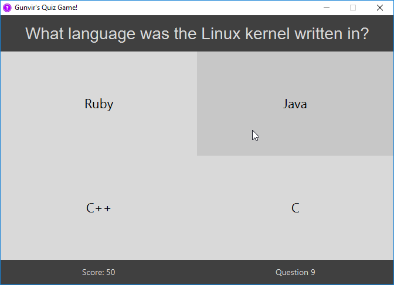
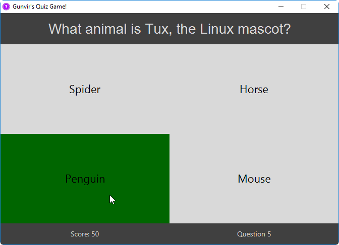
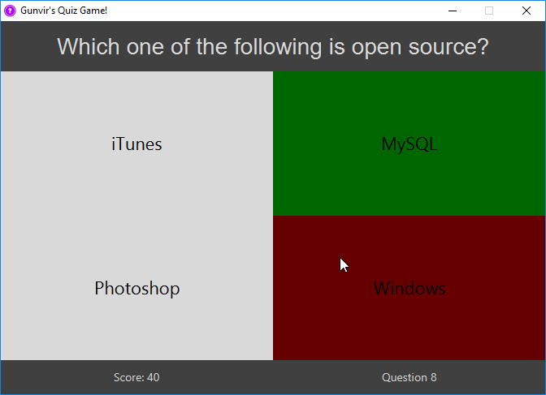
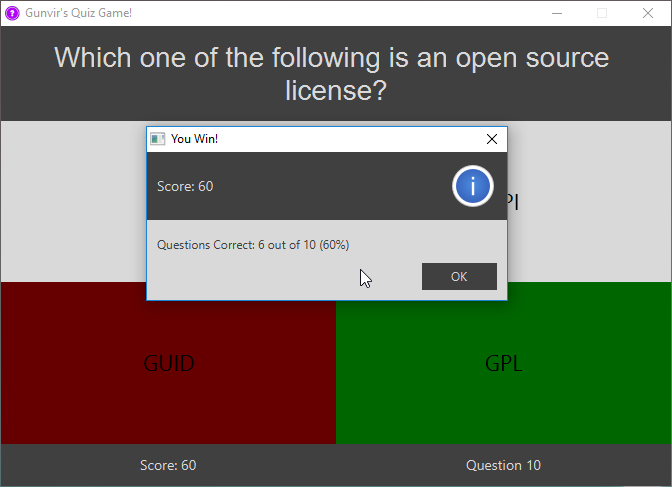

## Gunvir's Quiz-Game

Gunvir's material design Quiz Game built using JavaFX.

#### Info

This is a simple quiz game built with JavaFX.

Questions are read from an external file `questions.txt` which must be in the same directory as the program.

#### Screenshots

#### Adding Questions

Adding more questions is very easy.

All you have to do is add more lines to the `questions.txt` file.

This is the proper format to add new questions:

`question ; correct answer ; wrong answer ; wrong answer ; wrong answer`

Each term is seperated by a colon.

Comments can be added by starting a line with `//`.

Empty lines are also ignored.

#### Errors

If you get an alert stating `questions.txt` is not found, put the questions file in the same directory as the program. 

The file in this repo comes with 10 FOSS (Free and Open Source Software) questions pre-made.

If you get an alert stating no questions found in the `questions.txt`, make sure the file is properly formatted.

#### Release

I have compiled a jar and an exe and put them in a release.

The releases page can be found by clicking the releases button near the top of the page.

Feel free to download them along with the questions file and give it a try.
